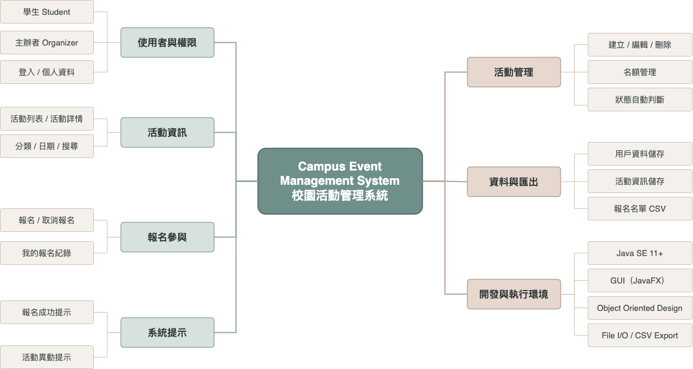
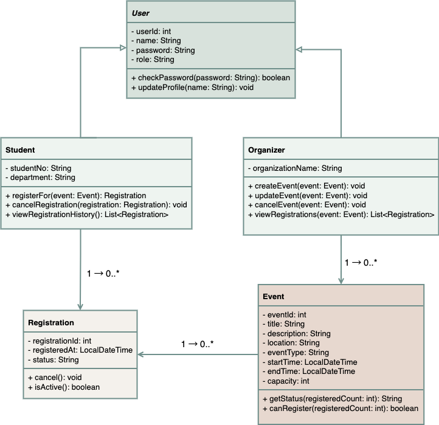
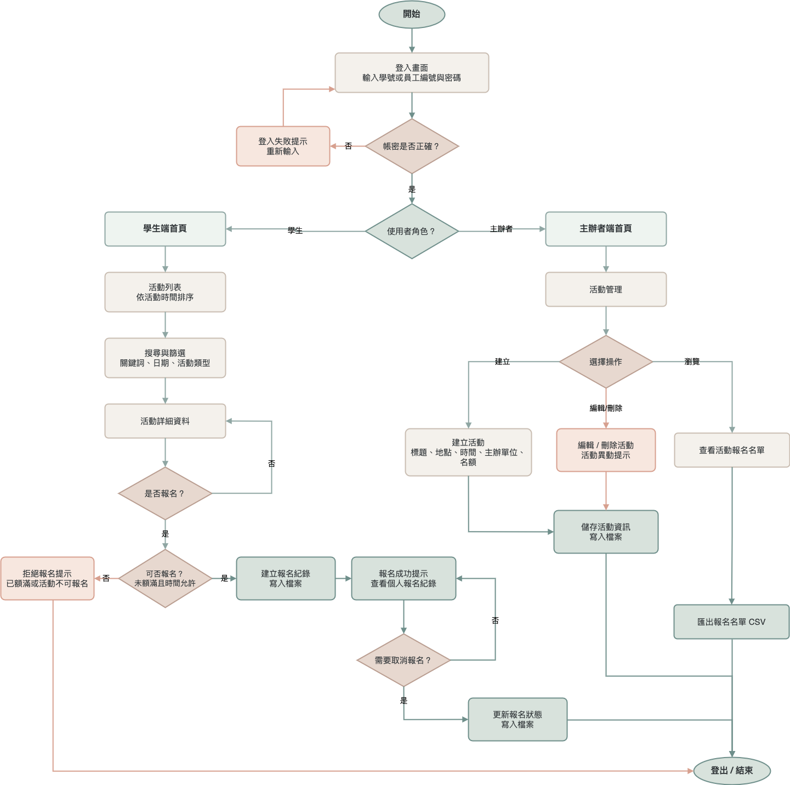

# Campus Event Management System

JavaFX campus event management system for the Object Oriented Programming final project.

This project is now developed as an individual final project, with a smaller scope focused on a stable demo and clear object-oriented design.

## Tech Stack

- Java SE 11+
- JavaFX
- Maven
- File I/O storage with CSV files

## Run

```bash
mvn clean javafx:run
```

## Demo Accounts

```text
Student
Account: A11423011
Password: 1234

Organizer
Account: O001
Password: 1234
```

## Data Files

```text
data/users.csv
data/events.csv
data/registrations.csv
exports/
```

## Design Documents

### System Function Architecture



### UML Class Diagram



### User Flow Diagram



## Current Scope

```text
Login
- Student / organizer authentication by account and password

Student features
- Event list sorted by event start time
- Event detail view
- Keyword search
- Date and event type filtering
- Event registration with capacity check
- Registration cancellation
- Personal registration history

Organizer features
- Create event
- Edit event
- Delete event
- View registration count
- Export active participant list to CSV

System features
- File I/O storage
- CSV export
- JavaFX GUI
```

## Development Plan

```text
6/9  Convert project to individual development scope; complete runnable JavaFX skeleton.
6/10 Complete student-side GUI and registration flow.
6/11 Complete organizer-side event management and CSV export.
6/12 Polish File I/O, error handling, and demo data.
6/13 Full workflow testing and bug fixing.
6/14 Prepare screenshots, demo script, and documentation.
6/15 Record demo video and build PPT.
6/16 Final submission.
```
